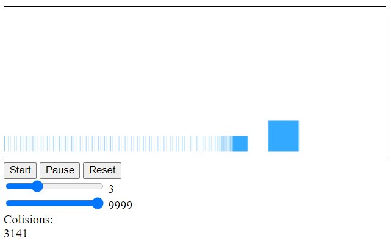
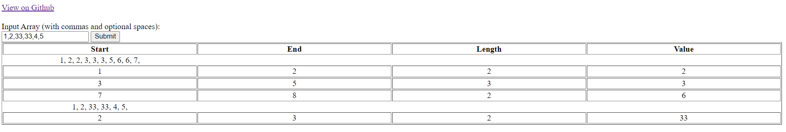

# Robloxcom-Testing-Enviroment
Testing environment for Robloxcom.me

PI-Blocks calculates PI:
Works by simulating physics collisions with blocks of adjustable masses and a static wall. The resulting number of collisions is a order magnitude of PI. You can use the command 'setup(power, accuracy) or 'setup(power, "auto")' in the console and press start to manually select paramaters for the blocks.

Array Parser calculates streaks of array elements:
Input an array of numbers, and it will return all "streaks" of adjacent recurring numbers in the array.

